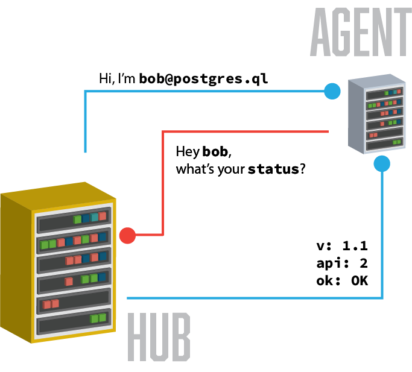
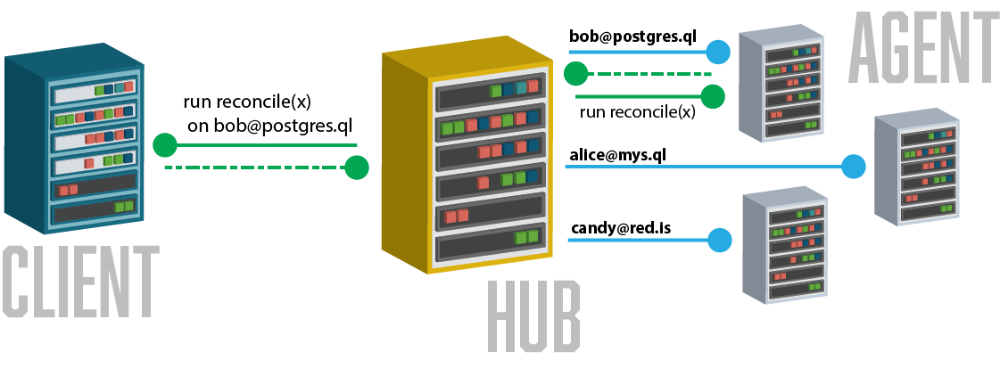
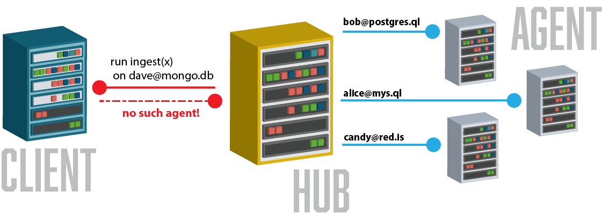

sFAB - An SSH Fabric for Distributed Agent Orchestration
========================================================

[](https://godoc.org/github.com/jhunt/go-sfab)

Welcome to sFAB, a utility library for stringing together
arbitrary agents, running across all types of IP networks, to form
an ad hoc execution fabric, all securely over SSH!

That's quite a mouthful.  We can do better.

sFAB lets you write programs that communicate securely, in a
hub-and-spoke topology.  The following concepts are key:

 - An **Agent** is a process running somewhere on the network, and
   performs tasks when asked to.

 - A **Hub** is a process running somewhere on the network.

 - Each **Agent** connects to one or more **Hubs**.

 - Commands are sent by consumers, via a **Hub**, and bound for a
   specific **Agent**.


How to Run a Hub
----------------

Before you can get a lot of mileage out of sFAB, we're going to need to spin
up a Hub:

```go
import (
  "github.com/jhunt/go-sfab"
)

func main() {
  hub := &Hub{
    Bind:        "*:4000",
    HostKeyFile: "host_key",
  }

  hub.AuthorizeKeys("authorized_keys")
  hub.ListenAndServe()
}
```

This will spin up a Hub (an SSH server) bound to all interfaces on TCP port
4000, using the contents of the `host_key` file as its private key, and
allowing anyone with a username + keypair listed in the `authorized_keys`
file to connect (as an Agent).


How Agents Connect to the Hub
-----------------------------

Agents connect to a Hub via the `Connect()` method:

```go
import (
  "io"

  "github.com/jhunt/go-sfab"
)

func main() {
  agent := &sfab.Agent{
    Identity:       "bob@postgres.ql",
    PrivateKeyFile: "id_rsa",
  }

  handler := func(msg []byte, stdout, stderr io.Writer) (int, error) {

    // ... do something useful here ...

    return 0, nil
  }

  agent.Connect("tcp4", "hub.fqdn:4000", handler)
}
```

This Agent's `Connect()` method will present the `Identity` of
"bob@postgres.ql" to the remote Hub, along with the private key stored in
the `id_rsa` file.



The authentication handshake (part of the [SSH-USERAUTH][1] protocol,
handled by lower layers of this library) identifies the agent.  The Hub must
have pre-authorized the use of our private key (from `id_rsa`) as the
identity "bob@postgres.ql".

The Hub records this information, and associates the agent name with the
SSH connection.  The next time one of its callers asks for something to be
executed against an agent named "bob@postgres.ql", the Hub will relay that
to this Agent, by doing the following:

  1. Opening an SSH "session" channel (per [section 5.1 of RFC-4254][2])
  2. Issuing an "exec" request (per [section 6.5 of RFC-4254][3])
  3. Copying output from the remote agent back to the caller, by way of the
     _responses_ (Go) channel.


Running Something on the Fabric
-------------------------------

To actually use this fabric, we need a third party, our _client_.
A client is just the Go code that calls into the Hub and asks for
things to be run against remote agents:



Here's an adjusted Hub implementation that attempts to
re-reconcile bob every 30 seconds:

```go
import (
  "fmt"
  "time"
  "os"

  "github.com/jhunt/go-sfab"
)

func main() {
  hub := &sfab.Hub{
    Bind:        "*:4000",
    HostKeyFile: "host_key",
  }

  hub.AuthorizeKeys("authorized_keys")

  go func() {
    t := time.NewTicker(30 * time.Second)
    for range t.C {

      /* every 30 seconds: */
      fmt.Fprintf(os.Stderr, "running reconciliation...\n")
      reply, _ := hub.Send("bob@postgres.ql", []byte("reconcile(x)"))

      for msg := range reply {
        if msg.IsStdout() || msg.IsStderr() {
          fmt.Printf("%s\n", msg.Text())

        } else if msg.IsError() {
          fmt.Fprintf(os.Stderr, "oops: %s\n", msg.Error())

        } else if msg.IsExit() {
          fmt.Fprintf(os.Stderr, "command exited %d\n", msg.ExitCode())
        }
      }
    }
  }()
  hub.ListenAndServe()
}
```

Now, our Hub will boot up, listen on `*:4000` as before (same host
keys, same authorizations), and then every 30 seconds will tell
bob to reconcile.

Next, let's modify the Agent implementation to do something:

```go
import (
  "io"
  "fmt"

  "github.com/jhunt/go-sfab"
)

func main() {
  agent := &sfab.Agent{
    Identity:       "bob@postgres.ql",
    PrivateKeyFile: "id_rsa",
  }

  handler := func(msg []byte, stdout, stderr io.Writer) (int, error) {

    if string(msg) == "reconcile(x)" {
      fmt.Fprintf(stdout, "BEGIN RECONCILIATION\n")
      reconciliation()
      fmt.Fprintf(stdout, "END RECONCILIATION\n")
      return 0, nil
    }

    fmt.Fprintf(stderr, "I'm sorry; I don't know how to '%s'\n", string(msg))
    return 1, nil
  }

  agent.Connect("tcp4", "hub.fqdn:4000", handler)
}
```


When Agents Aren't Available
----------------------------

So what happens if an agent is unavailable?

If it's a temporary availability issue, and the Agent is
maintaining its connection to the Hub, the messages sent by
`Send()` will be queued in the goroutine.

If the Agent has left (or has not yet connected), the Hub will
respond to the caller accordingly:




Halting an Agent
----------------

At times, you may want an _in-line_ method of terminating an
Agent on behalf of a Client, through the Hub.  The handler
function that gets passed to the Agent's `Connect()` method
can return an error to signal this condition.  The Agent will
process the error (logging it, mostly), and then break out of its
main event loop, effectively shutting down.

Note that this error will not propagate to the caller of
`Connect()`; the error returned by that function is intended
solely to signal a _problem_ handling the connection, and exiting
early is not problematic.

Here's an example:

```go
handler := func(msg []byte, stdout, stderr io.Writer) (int, error) {

  if string(msg) == "EXEUNT" {
    fmt.Fprintf(stdout, "exiting...\n")
    return 0, fmt.Errorf("exit requested")
  }

  // ... other, more useful work here ...

  return 0, nil
}

agent.Connect("tcp4", "hub.fqdn:4000", handler)
```


Contributing
============

This code is licensed MIT.  Enjoy.

If you find a bug, please raise a [Github Issue][issues] first,
before submitting a PR.

Happy Hacking!


[1]: https://tools.ietf.org/html/rfc4252
[2]: https://tools.ietf.org/html/rfc4254#section-5.1
[3]: https://tools.ietf.org/html/rfc4254#section-6.5

[issues]: https://github.com/jhunt/go-sfab/issues
